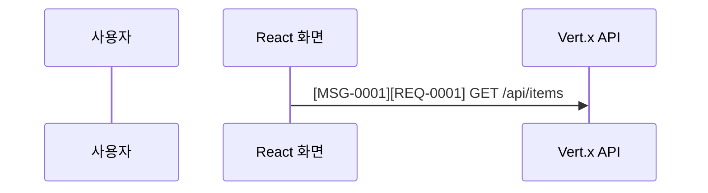

# 목표

확정된 호출 순서만 Mermaid `sequenceDiagram`으로 표현하고 각 메시지를 근거와 요구사항으로 역추적한다.

## 전제 조건

- `TRACE_FILE`을 대상 JSON 경로로 설정하고 `jq -e -f "${OPENCODE_CONFIG_DIR:-$HOME/.config/opencode}/recipes/trace.jq" "$TRACE_FILE"`로 입력 trace 전체를 검증해야 한다.
- 한 다이어그램은 requirement 20개, participant 12개, message 50개 이하이다.
- `jq`, `rg`, `mmdc`를 사용할 수 있어야 한다.

## 상태 기계

1. `jq -e '.joins | map(select(.status == "exact")) | length > 0' <trace.json>`으로 확정 연결이 있는지 확인한다. 없으면 그리지 않고 `UNKNOWN`으로 종료한다.
2. participant ID는 ASCII 대문자·숫자·`_`만 사용하고 라벨은 한글로 쓴다. 각 participant는 검증된 계층 하나만 나타낸다.
3. 다이어그램 위에 사용한 요구사항마다 `%% REQ: <REQ-ID> | <source>:<line>` 주석을 둔다.
4. 각 화살표 바로 앞에 `%% MSG: <MSG-ID> | evidence=<E-ID,...> | source=<path:line,...>` 주석을 둔다. `MSG-ID`는 유일해야 한다. 화살표 라벨은 `[MSG-0001][REQ-0001,REQ-0002] 실제 method, path, address 또는 응답 값` 형식으로 시작한다. 연결할 요구사항이 없음을 근거로 확정한 경우에만 두 번째 태그를 `[NO-REQ]`로 쓴다.
5. 요청·응답 순서는 소스 또는 명세로 증명될 때만 쓴다. reply, failure, timeout 근거가 없으면 성공 분기나 오류 분기를 발명하지 않고 별도 `UNKNOWN`으로 보고한다.
6. 복수 대상이 남은 연결은 하나의 화살표로 축약하지 않는다. `AMBIGUOUS`로 중단하거나 후보별 별도 다이어그램을 만든다.
7. `SEQUENCE_FILE`을 산출물 경로로 설정하고 `jq -e --arg kind mermaid --rawfile artifact "$SEQUENCE_FILE" -f "${OPENCODE_CONFIG_DIR:-$HOME/.config/opencode}/recipes/provenance.jq" "$TRACE_FILE"`로 모든 MSG·REQ·evidence·source의 1:1 exact 대응을 검사한다. 이어 `rg --no-config '(->>|-->>)' "$SEQUENCE_FILE" | rg --no-config -v '\[MSG-[0-9]{4}\]\[(REQ-[0-9]{4}(,REQ-[0-9]{4})*|NO-REQ)\]'`를 실행한다. 두 번째 명령은 출력 없이 종료 코드 1이어야 한다. 마지막으로 `mmdc --quiet --input "$SEQUENCE_FILE" --output <sequence.svg>`로 실제 렌더하며 종료 코드 0과 비어 있지 않은 SVG가 모두 필요하다.

## 최소 형식

## 실패 폐쇄

- 인라인 `MSG`/`REQ` 또는 `NO-REQ` 태그가 없는 메시지, 대응하는 exact 근거 ID·전체 source가 없는 메시지, 선언되지 않은 participant, 중복 ID, 근거 없는 순서, Mermaid 파싱 오류는 실패다.
- 렌더가 실패하면 기존 SVG를 성공 산출물로 취급하지 않는다.
